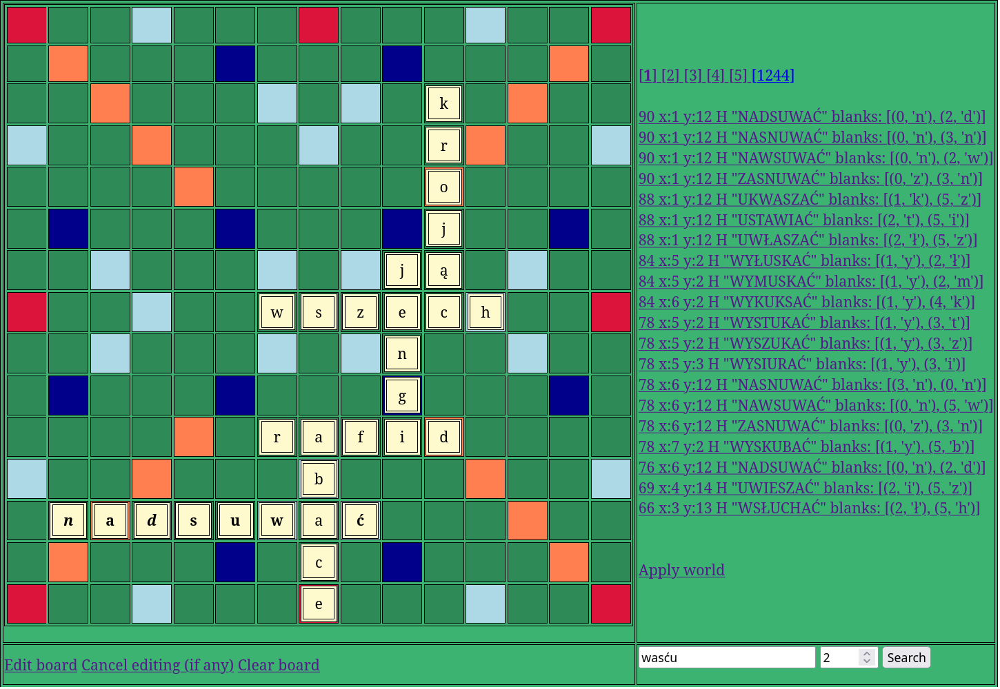

# Scrabble Cheat 

## Overwiev

A simple program written in Python which helps with Scrabble game.  
It uses framework CherryPy so it is easy to use it on a mobile phone with a browser.  

It works with Polish dictionary but it should be easy to switch the language.  

Blanks are written with italics. 
Preview of the new word is written with bold.  
In edit mode it is possible mark blanks with a checkbox.  
Searching needs player's letters and number of its blanks.  
Points are calculating with respecting player's blanks and with blanks on the board.  

## How to create own language

You need a file with words which looks like <i>PolishWords.py</i>  
See the file <i>PolishScrabble.py</i>.  
There you can see that it is needed a dictionary which looks like <i>polishWordScores</i>.  
Then you have to create an alphabet from the dictionary  
and create a <i>WordList</i> with this alphabet and the word list.  
At last you must replace <i>getPolishScrabbleBoard</i> in <i>ScrabbleMain.py</i> with your new function.  
